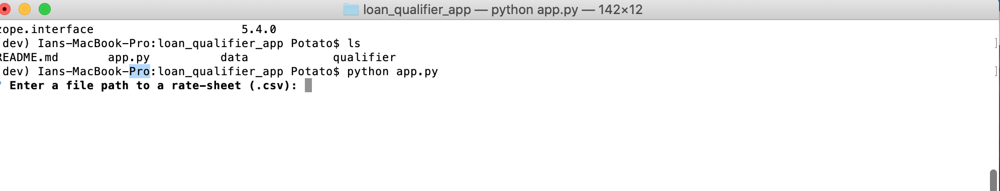

# Loan Qualifier Application

This is an application designed to facilitate the loan application process for people seeking a loan based on fundamental financial criteria. Applicants often want an idea of what lenders would be potentially willing to offer them a loan prior to speaking with a customer service agent, saving time for all parties. 

## Technologies

This application was written using python 3.7 and is designed to be executed through a CLI (command line interface), such as Terminal (MacOS) or GitBash (Windows). Below are the critical dependencies used and associated documentation:

* [python](https://www.python.org/downloads/) 3.7.11 

* [questionary](https://www.python.org/downloads/) 1.10.0

* [fire](https://google.github.io/python-fire/guide/) 0.4.0
___

## Installation Guide

Before running the application, make sure that a python development environment has been activated in the CLI. 

Install the following dependencies:

```python
    pip install fire
    pip install questionary
```

The primary python file in this application is app.py
___

## Usage

To use the loan qualifier application clone the repo using the link on GitHub and run  `app.py` with:

```python
    python app.py
```

Upon running this code you will be asked to enter the file path to the rate-sheet containing the list of banks and loan qualifications:


